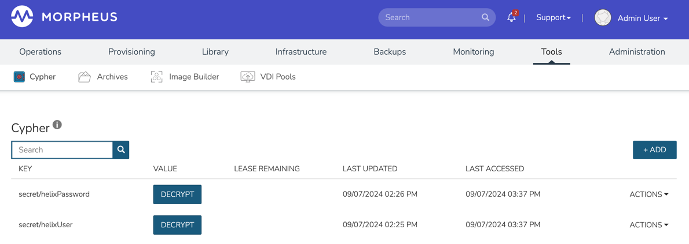
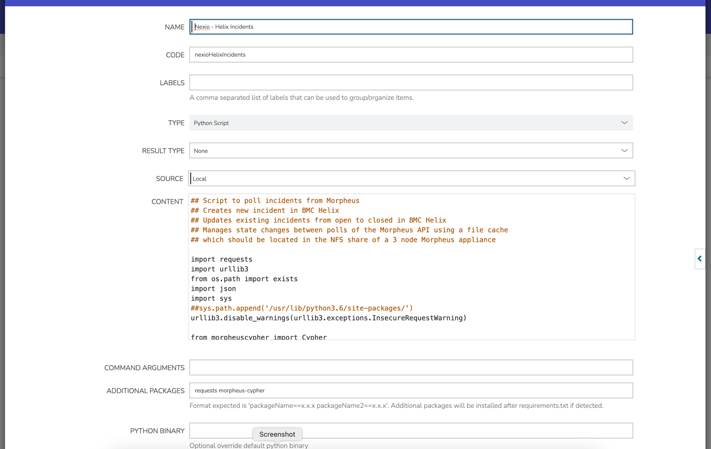
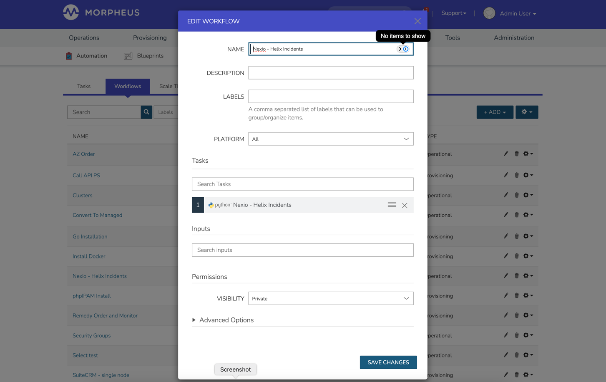

## Implementation


### Python 
Python & Venv needs to be installed on all appliance nodes.
Script is Python3 (developed against 3.9.10, but not necessary to run exact version)

Check packages installed

```shell
pip list
```

```shell
pip install requests
```

```shell
pip install morpheus-cypher
```

### Data Cache
Create the subfolder & cache file in the shared directory:

```shell
cd /var/opt/morpheus/morpheus-ui/
```

```
mkdir caches
```

``` 
touch caches/incidentStateCache.json
```

Create empty JSON object in the file:

```json
{}
```

Change ownership:

```shell
chown -R morpheus-app:morpheus-local caches
```

Change permissions: 

```shell
chmod 666 caches/incidentStateCache.json
```

### Secrets

Implement Cypher secrets on the following mounts:

```shell
## Username 
secret/helixUser

## Password
secret/helixPassword
```



### Create the Task



### Create the Operational Workflow



### Assign the Workflow to a Job

Set up Workflow Job running on a 5 minute schedule.


### Create schedule & job

Use this cron expression for every 5 minutes:

```shell
*/5 * * * *
```